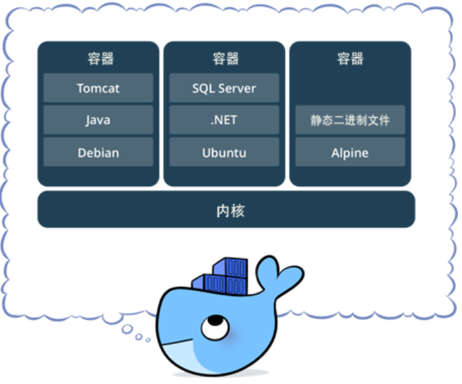
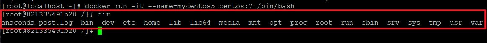
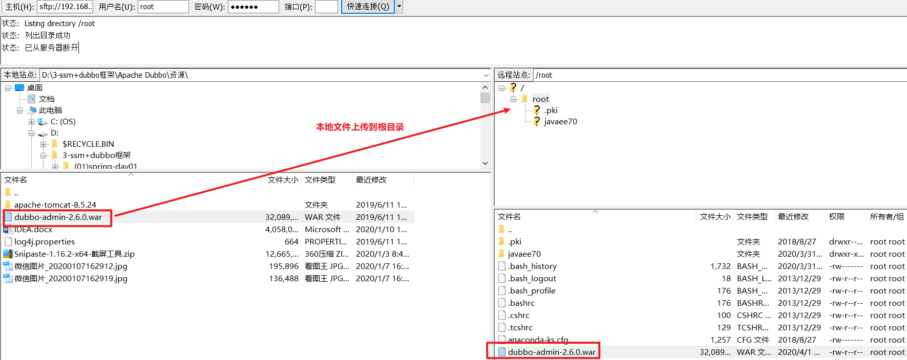

# Docker容器虚拟化

## 学习目标：

-   掌握Docker基础知识，能够理解Docker镜像与容器的概念
-   完成Docker安装与启动
-   掌握Docker镜像与容器相关命令
-   掌握Tomcat Nginx 等软件的常用应用的安装
-   掌握docker迁移与备份相关命令
-   能够运用Dockerfile编写创建容器的脚本
-   能够搭建与使用docker私有仓库

# 第一章 Docker简介

## 1.1 什么是虚拟化

虚拟化，是指通过虚拟化技术将一台计算机虚拟为多台逻辑计算机。在一台计算机上同时运行多个逻辑计算机，每个逻辑计算机可运行不同的操作系统，并且应用程序都可以在相互独立的空间内运行而互不影响，从而显著提高计算机的工作效率。

 虚拟化技术种类很多，例如：软件虚拟化、硬件虚拟化、内存虚拟化、网络虚拟化(vip)、桌面虚拟化、服务虚拟化、虚拟机等等。

**问题：**为什么会有docker出现？

一款产品从开发到上线，从操作系统，到运行环境，再到应用配置。作为开发+运维之间的协作我们需要关心很多东西，这也是很多互联网公司都不得不面对的问题，特别是各种版本的迭代之后，不同版本环境的兼容，对运维人员都是考验 , 这个时候 Docker 横空出世，是因为它对此给出了一个标准化的解决方案。

环境配置如此麻烦，换一台机器，就要重来一次，费力费时。很多人想到，能不能从根本上解决问题，软件可以带环境安装？也就是说，安装的时候，把原始环境一模一样地复制过来。开发人员利用 Docker 可以消除协作编码时“在我的机器上可正常工作”的问题。


之前，可以发现，每发布一个程序，都要走一遍以上的流程：

## 1.2 什么是Docker

Docker 是一个开源的应用容器引擎，基于 Go 语言开发。Docker 可以让开发者打包他们的应用以及依赖包到一个轻量级、可移植的容器中，然后发布到任何流行的 Linux 机器上，也可以实现虚拟化。容器是完全使用沙箱机制，相互之间不会有任何接口（类似 iPhone 的 app）,更重要的是容器性能开销极低。

Docker的主要目标是“Build，Ship and Run Any App,Anywhere”，也就是通过对应用组件的封装、分发、部署、运行等生命周期的管理，使用户的APP（可以是一个WEB应用或数据库应用等等）及其运行环境能够做到“一次封装，到处运行”。

总之一句话：只需要一次配置好环境，换到别的机子上就可以一键部署好，大大简化了操作 。


-   为什么选择Docker?
    -   Docker的镜像提供了除内核外完整的运行时环境，确保了应用运行环境一致性，从而不会再出现“这段代码在我机器上没问题啊”这类问题；——**一致的运行环境**
    -   可以做到秒级、甚至毫秒级的启动时间。大大的节约了开发、测试、部署的时间。——**更快速的启动时间**
    -   避免公用的服务器，资源会容易受到其他用户的影响。——**隔离性**
    -   善于处理集中爆发的服务器使用压力；——**弹性伸缩，快速扩展**
    -   可以很轻易的将在一个平台上运行的应用，迁移到另一个平台上，而不用担心运行环境的变化导致应用无法正常运行的情况。——**迁移方便**
    -   使用Docker可以通过定制应用镜像来实现持续集成、持续交付、部署。——**持续交付和部署**
-   Docker应用场景

    ① Web 应用的自动化打包和发布

    ② 自动化测试和持续集成、发布

    ③ 在服务型环境中部署和调整数据库或其他的后台应用

使用Docker可以实现开发人员的开发环境、测试人员的测试环境、运维人员的生产环境的一致性。


Docker借鉴了标准集装箱的概念。标准集装箱将货物运往世界各地，Docker将这个模型运用到自己的设计中，唯一不同的是：集装箱运输货物，而Docker运输软件。

## 1.3 容器与虚拟机比较

下面的图片比较了 Docker 和传统虚拟化方式的不同之处，可见容器是在操作系统层面上实现虚拟化，直接复用本地主机的操作系统，而传统方式则是在硬件层面实现。

-   传统虚拟机


传统虚拟机技术基于安装在主操作系统上的虚拟机管理系统（如：VirtualBox和VMWare等），创建虚拟机（虚拟出各种硬件），在虚拟机上安装从操作系统，在从操作系统中安装部署各种应用。

-   Docker


Docker容器是在操作系统层面上实现虚拟化，直接复用本地主机的操作系统，而传统虚拟机则是在硬件层面实现虚拟化。与传统的虚拟机相比，Docker优势体现为启动速度快、占用体积小。

-   使用上的区别


简单来说： 容器和虚拟机具有相似的资源隔离和分配优势，但功能有所不同，因为容器虚拟化的是操作系统，而不是硬件，因此容器更容易移植，效率也更高。

## 1.4 Docker 组件

### 1.4.1 Docker组成部分

Docker是一个客户端-服务器（C/S）架构程序。Docker客户端只需要向Docker服务器或者守护进程发出请求，服务器或者守护进程将完成所有工作并返回结果。Docker提供了一个命令行工具Docker以及一整套RESTful API。你可以在同一台宿主机上运行Docker守护进程和客户端，也可以从本地的Docker客户端连接到运行在另一台宿主机上的远程Docker守护进程。


### 1.4.2 Docker镜像与容器

**镜像：**类似虚拟机镜像 , 是一个特殊的文件系统

操作系统分为内核和用户空间。对于Linux而言，内核启动后，会挂载root文件系统为其提供用户空间支持。而Docker镜像（Image），就相当于是一个root文件系统。

Docker镜像是一个特殊的文件系统，除了提供容器运行时所需的程序、库、资源、配置等文件外，还包含了一些为运行时准备的一些配置参数（如匿名卷、环境变量、用户等）。 镜像不包含任何动态数据，其内容在构建之后也不会被改变。

**容器：**类似linux系统环境，运行和隔离应用。是镜像运行时的实体

镜像（Image）和容器（Container）的关系，就像是面向对象程序设计中的类和实例一样，镜像是静态的定义，容器是镜像运行时的实体。容器可以被创建、启动、停止、删除、暂停等 。

**仓库：**集中存放镜像文件的地方。

镜像构建完成后，可以很容易的在当前宿主上运行，但是， 如果需要在其它服务器上使用这个镜像，我们就需要一个集中存储、分发镜像的地方，比如后面我们要学的，Docker Registry就是这样的服务。

### 1.4.3 Registry（注册中心）

Docker用Registry来保存用户构建的镜像。Registry分为公共和私有两种。Docker公司运营公共的Registry叫做**Docker Hub**。用户可以在Docker Hub注册账号，分享并保存自己的镜像（说明：在Docker Hub下载镜像巨慢，可以自己构建私有的Registry）。

 <https://hub.docker.com/>

# 第二章 Docker安装与启动

## 2.1 安装Docker-CentOS7

Docker官方建议在Ubuntu中安装，因为Docker是基于Ubuntu发布的，而且一般Docker出现的问题Ubuntu是最先更新或者打补丁的。在很多版本的CentOS中是不支持更新最新的一些补丁包的。​ 由于我们学习的环境都使用的是CentOS，因此这里我们将Docker安装到CentOS上。

**注意：**这里建议安装在CentOS7.x以上的版本，在CentOS6.x的版本中，安装前需要安装其他很多的环境，而且Docker很多补丁不支持更新。

1.  官网中文安装参考手册

<https://docs.docker.com/install/linux/docker-ce/centos/>

1.  确定你是CentOS7及以上版本

    cat /etc/redhat-release

2.  yum安装gcc相关
    -   CentOS7能上外网
    -   检查gcc和g++是否安装好，如果没有安装好，则需要安装。
    -   安装gcc和g++

        yum -y install gcc

        yum -y install gcc-c++

3.  安装需要的软件包

| yum install -y yum-utils device-mapper-persistent-data lvm2 |
|-------------------------------------------------------------|

1.  设置镜像仓库
    -   **大坑(千万不要试，网速慢，超时，安装不上)**

| yum-config-manager --add-repo （centos快速添加yum源）<https://download.docker.com/linux/centos/docker-ce.repo>  报错：官网太慢，一定超时。 [Errno 14] curl\#35 - TCP connection reset by peer [Errno 12] curl\#35 - Timeout |
|-----------------------------------------------------------------------------------------------------------------------------------------------------------------------------------------------------------------------------|

-   推荐：阿里云服务器

| yum-config-manager --add-repo <http://mirrors.aliyun.com/docker-ce/linux/centos/docker-ce.repo> |
|-------------------------------------------------------------------------------------------------|

1.  更新yum软件包索引

| yum makecache fast |
|--------------------|

1.  安装DOCKER CE（社区版）（DOCKER EE企业版收费）

| yum -y install docker-ce |
|--------------------------|

1.  启动docker
    -   手动启动：systemctl start docker
    -   自动启动：systemctl enable docker
2.  测试
    -   检查版本：docker version
    -   下载并运行HelloWorld：docker run hello-world
        -   如果下载不下来，可以配置镜像加速器
        -   输出这段提示以后，hello world就会停止运行，容器自动终止。


-   run干了什么


1.  配置镜像加速CentOS7版本

    mkdir -p /etc/docker

    vim /etc/docker/daemon.json

    -   **\#网易云**

| { "registry-mirrors": ["<http://hub-mirror.c.163.com>"] } |
|-----------------------------------------------------------|

-   **\#阿里云(推荐)**

| { "registry-mirrors": ["<https://8y2y8njn.mirror.aliyuncs.com>"] } |
|--------------------------------------------------------------------|

-   **\#ustc**

    \#是老牌的linux镜像服务提供者了，还在遥远的ubuntu 5.04版本的时候就在用。ustc的docker镜像加速器速度很快。

    \#ustc docker mirror的优势之一就是不需要注册，是真正的公共服务。

    \#<https://lug.ustc.edu.cn/wiki/mirrors/help/docker>

    在该文件中输入如下内容：

| { "registry-mirrors": ["<https://docker.mirrors.ustc.edu.cn>"] } |
|------------------------------------------------------------------|

systemctl daemon-reload

systemctl restart docker

1.  卸载
    -   systemctl stop docker
    -   yum -y remove docker-ce
    -   rm -rf /var/lib/docker
    -   卸载旧版本
        -   2019.11英文官网版本
            -   最新的英文版：https://docs.docker.com/install/linux/docker-ce/centos/\#uninstall-old-versions

| yum remove docker \\ docker-client \\ docker-client-latest \\ docker-common \\ docker-latest \\ docker-latest-logrotate \\ docker-logrotate \\ docker-engine |
|--------------------------------------------------------------------------------------------------------------------------------------------------------------|

## 2.2 Docker的启动与停止

### 2.2.1 命令

| 启动docker：         | systemctl start docker   |
|----------------------|--------------------------|
| 停止docker：         | systemctl stop docker    |
| 重启docker：         | systemctl restart docker |
| 查看docker状态：     | systemctl status docker  |
| 开机启动：           | systemctl enable docker  |
| 查看docker概要信息： | docker info              |
| 查看docker帮助文档： | docker --help            |

### 2.2.2 帮助手册：docker --help

![计算机生成了可选文字: [root@10Ca1h05t～]\#docker——help Usage：docker[OPTIONS]CO\>NAND 旮self—sufficxentruntImeforcontaxners Options： —configstring —debug —host1主st —log—levelstring —t1s —tlscacertstring —tlscertstring —tlskeystring —tlsverify —Ve工On ManagementCommands： LocationOfclientconfigf土1e5(default"/root/-docker") Enabledebugmode Daemonsocket（5）toconnectto setthelogginglevel("debug"\|"主n上0"\|"warn""error""fatal")(default UseTLS;impliedby——tlsverify TrustcertssignedonlybythisCA(default"/root/.docker/ca.pem") Path℃0TLScertificatefile(default"/root/.docker/cert.pem") PathtoTLSkeyfile(defaultT'/root/.docker/key.pem") UseTLSandverifytheremote Printversxoninformationandquit "主n上0"） config container Image network node plugin secret SerVICe stack Swarm system trust volume Cornmands: attach buiId commit CP create diff Manage Manage Manage Manage Manage Manage Manage Manage Manage Manage Manage Manage Manage Attach Dockerconfigs containers Images ne℃orks Swarmnodes plugins Dockersecrets SerVICeS Dockerstacks Swarm Docker trustonDockerimages volume5 localstandardinput,output，anderrorstreamstoarunningcontainer BuildanImagefromaDockerfile CreateanewImagefroma5ChangeS Copy上土1e5/上oldersbetweenacontainerandthelocalfilesystem Createanewcontainer Inspectchangestofilesordirectoriesonacontainer'5filesvstem](media/8c3fb774801e2db9cbf6667d2d80f452.png)


### 2.2.3 指令介绍

| cp      | 本地文件系统(OS操作系统\|宿主机)和容器之间进行文件或者文件夹拷贝 |
|---------|------------------------------------------------------------------|
| exec    | 登录一个容器，使用命令行操作正在运行的容器。                     |
| images  | 镜像的集合查询。                                                 |
| ps      | 容器列表                                                         |
| pull    | 下载镜像                                                         |
| restart | 重启一个或多个容器                                               |
| rm      | 删除一个或多个容器                                               |
| rmi     | 删除一个或多个镜像                                               |
| run     | 创建一个容器，并运行起来                                         |
| save    | 导出镜像到一个文件(tar)中                                        |
| search  | 搜索镜像（从Docker Hub）                                         |
| start   | 启动一个或多个已经停止的容器                                     |
| stop    | 停止一个或多个正在运行的容器                                     |

# 第三章 常用命令

镜像：Docker镜像是由文件系统叠加而成（是一种文件的存储形式）；是docker中的核心概念，可以认为镜像就是对某些运行环境或者软件打的包，用户可以从docker仓库中下载基础镜像到本地，比如，开发人员可以从docker仓库拉取（下载）一个只包含centos7系统的基础镜像，然后在这个镜像中安装jdk、mysql、Tomcat和自己开发的应用，最后将这些环境打成一个新的镜像。开发人员将这个新的镜像提交给测试人员进行测试，测试人员只需要在测试环境下运行这个镜像就可以了，这样就可以保证开发人员的环境和测试人员的环境完全一致。

## 3.1 镜像相关命令

### 3.1.1 查看镜像

查看镜像可以使用如下命令：docker images

![计算机生成了可选文字: [r00℃@localhost 、]\#dockerimages REPOSITORY TAG -jdkl．8 latest mytomcat主 latest centos/mysg1—57—centos7 latest 7 centos latest 7—jre7 tomcat latest ngInX registry latest IMAGEID 518C2bb83f4e e92dc1dd9e2a 2e4ddfafaa6f 5182e96772bf 4e8db158f18d fa2C33156fb9 c82521676580 b2b03e9146e1 CREATED 2hoursago 23 19 20 20 20 20 21 hOUESago months months months months months months ago ago ago ago ago ago SIZE 576MB 357B 445MB 20OMB 83．4MB 357B 109MB 33·3MB](media/8dfba12eb5b8a545e4c63f5ffbddc582.png)

-   REPOSITORY：镜像名称
-   TAG：镜像标签（版本）
-   IMAGE ID：镜像ID
-   CREATED：镜像的创建日期（不是获取该镜像的日期）
-   SIZE：镜像大小

    这些镜像都是存储在Docker的 /var/lib/docker 目录下

### 3.1.2 搜索镜像

从网络中查找需要的镜像：docker search 镜像名称

例如 下载一个 nginx 镜像


-   NAME：仓库名称
-   DESCRIPTION：镜像描述
-   STARS：用户评价，反应一个镜像的受欢迎程度
-   OFFICIAL：是否官方
-   AUTOMATED：自动构建，表示该镜像由Docker Hub自动构建流程创建

### 3.1.3 拉取镜像

拉取镜像就是从Docker仓库下载镜像到本地，镜像名称格式为 【名称:版本号】，如果版本号不指定则是最新的版本

命令：docker pull 镜像名称  
下载一个 nginx 的镜像 , 需要注意：如果下载的时候，不指定版本，会下载最新版本


刚刚下载的镜像通过 docker images 就可以查看


### 3.1.4 删除镜像

可以按照镜像id删除镜像，命令如下：docker rmi 镜像ID


删除单个镜像(-f 强制删除)：docker rmi -f 镜像ID

删除多个镜像：docker rmi -f 镜像名1:TAG 镜像名2:TAG

删除所有镜像：docker rmi -f \$(docker images -qa)

### 3.15 从Docker Hub拉取

Docker镜像首页，包括官方镜像和其它公开镜像。Docker Hub上最受欢迎的10大镜像（通过Docker registry API获取不了镜像被pull的个数，只能通过镜像的stars数量来衡量镜像的流行度。毫无疑问，拥有最高stars数量的库都是官方库）。

<https://hub.docker.com/search?image_filter=official&type=image>

![计算机生成了可选文字: ．redis Updatedanhour0g0 Redisisanopensourcekey-valuestorethatfunctions353datastructureserver. Container ubuntu Linux Windows mips641eARM5413MZx854ARM 385 OFFICIALIMAGE0 10M+8.2K Do和0asS巧 Databases OFFICIALIMAGE0 PowerPC04LE 8已seImages 10M+ Do“剂0已as OperatingSystems 1OK+ S巧 Updatedanhour0g0 Ubuntuis3Debian-basedLinuxoperatingsystembasedonfreesoftware. Container Linux ARM 385 13MZ PowerPC54LEARM04×80．54 OFFICIALIMAGE0 10M+6.9K Do和0asS巧 Updatedanhour0g0 MongoDBdocumentdatabasesprovidehighavailabilityandeasyscalability、 Container Windows 13MZ ARM64 x85．54 Databases](media/21fe65e0ed09cadb6b03360e2de4d0a6.png)

国情的原因，国内下载 Docker HUB 官方的相关镜像比较慢，可以使用国内（docker.io）的一些镜像加速器，镜像保持和官方一致，关键是速度快，推荐使用。

## 3.2 容器相关命令

**容器**也是docker中的核心概念，镜像是创建容器的软件 , 容器是由镜像运行产生的运行实例。镜像和容器的关系，就如同Java语言中类和对象的关系。

如果需要通俗的描述容器的话，我觉得容器就是一个存放东西的地方，就像书包可以装各种文具、衣柜可以放各种衣服、鞋架可以放各种鞋子一样。我们现在所说的容器存放的东西可能更偏向于应用。比如网站、程序甚至是系统环境。



### 3.2.1 查看容器

| 查看正在运行的容器：     | docker ps                  |
|--------------------------|----------------------------|
| 查看所有容器：           | docker ps –a               |
| 查看最后一次运行的容器： | docker ps –l               |
| 查看停止的容器：         | docker ps -f status=exited |

### 3.2.2 创建与启动容器

① 什么是宿主机？

就是主机，这个概念是相对于子机而言的，比如你安装有虚拟机的话，那么相对于虚拟机而言，你正在使用的计算机就是宿主机，虚拟机是安装在主机上的，必须在主机上才能运行，主机就是一个“宿主”。

② 创建容器常用的参数说明：

创建容器命令：docker run

| -i：表示运行容器 -t：表示容器启动后会进入其命令行。加入这两个参数后，容器创建就能登录进去。即分配一个伪终端。 --name :为创建的容器命名。 -v：表示目录映射关系（前者是宿主机目录，后者是映射到宿主机上的目录），可以使用多个－v做多个目录或文件映射。注意：最好做目录映射，在宿主机上做修改，然后共享到容器上。 -d：在run后面加上-d参数,则会创建一个**守护式容器**在后台运行（这样创建容器后不会自动登录容器，如果只加-i -t两个参数，创建后就会自动进去容器）。 -p：表示端口映射，前者是宿主机端口，后者是容器内的映射端口。可以使用多个-p做多个端口映射 |
|---------------------------------------------------------------------------------------------------------------------------------------------------------------------------------------------------------------------------------------------------------------------------------------------------------------------------------------------------------------------------------------------------------------------------------------------------------------------------------------------------------------------------------------------------------|

**（1）交互式方式创建容器**

以交互式方式创建并启动容器，启动完成后，直接进入当前容器。使用exit命令退出容器。需要注意的是以此种方式启动容器，如果退出容器，则容器会进入停止状态。可以理解成交互式容器 是前台容器。

```
docker run -it --name=容器名称 镜像名称:标签 /bin/bash
# 比如：docker run -it --name=mycentos centos:7 /bin/bash
# docker run:表示创建容器
# -it：表示运行容器并进入它的命令行
# --name=mycentos：给当前的容器命名
# centos:7：使用该镜像创建
# /bin/bash：放在镜像名后的是命令，这里我们希望有个交互式 Shell，因此用的是 /bin/bash
```

创建好容器，并且已经进入到容器内部了，可以直接观察前面中括号里面的内容发现，跟创建容器之前不一样了，

并且 通过 dir 命令，会发现，其实容器内部也是一个 centos , 我们可以把每个容器都看成一个小电脑或者服务器



重新开一个新的会话，查看刚刚创建的容器是否已经有了。


查看正在运行的容器：docker ps

退出当前容器：**exit**

退出之后，容器也退出了，没有删除

**(2) 创建后台容器**

**docker run -id --name=mycentos2 centos:7**

查看 docker 容器已经运行

**(3) 守护式方式创建容器：**

创建一个守护式容器；如果对于一个需要长期运行的容器来说，我们可以创建一个守护式容器。

命令如下（容器名称不能重复）：守护容器可以理解成在后台运行的容器

```
# 守护式容器和交互式容器的创建方式区别：
# ① -it 换成 -di
# ② 去掉后面的 /bin/bash
docker run -di --name=容器名称 镜像名称:标签
# 比如：docker run -di --name=mycentos10 centos:7
```

通过 docker ps 查看容器已经是运行状态

进入守护式容器方式：

```
docker exec -it 容器名称 (或者容器ID)  /bin/bash
# 比如  docker exec -it mycentos10 /bin/bash
```

已经进入到容器内部了，如果现在退出exit，然后查看容器docker ps是否还在后台运行（仍在运行）

### 3.2.3 停止与启动容器

-   先通过 docker ps 查看正在运行的容器
-   停止容器：

| docker stop 容器名称（或者容器ID） 例如： docker stop mycentos2 |
|-----------------------------------------------------------------|

-   创建完容器之后，停止容器

![计算机生成了可选文字: [root@localhost、]\#dockerrun—id——name=mycentos2centos：7 12e44d58ada84C45828249aab94958b9CC96782a690daa4e6abd8a1571179e80 [root@localhost、]\#dockerstopmycentos2 mycentos2](media/0adf6e45e433391ba782d17faf860905.png)

-   查看容器是否已经停止
-   启动容器：

| docker start 容器名称（或者容器ID） 例如： docker start mycentos2 （以交互式运行的容器，只是第一次exit退出的时候会关闭容器，当用start启动的时候，就相当于后台启动了，exec进去之后再exit退出不会关闭容器） |
|-----------------------------------------------------------------------------------------------------------------------------------------------------------------------------------------------------------|

-   查看容器是否已经启动

### 3.2.4 文件拷贝

我们需要在容器内安装一个软件，软件首先需要有安装包，我们就需要把安装包拷贝到容器内。我们通常的操作是先把文件上传到宿主机，然后我们在将文件从宿主机拷贝到容器内的某个目录下面进行安装。

将linux宿主机中的文件拷贝到容器内可以使用命令：


如果我们需要将文件拷贝到容器内可以使用cp命令

| docker cp 需要拷贝的文件或目录 容器名称:容器目录 例如： docker cp anaconda-ks.cfg mycentos2:/usr/local/ |
|---------------------------------------------------------------------------------------------------------|

拷贝一个文件到 mycentos2 的 /urs/local/ 文件下面 ，拷贝完成之后，删除文件，然后在mycentos2拷贝过来


登录容器查看拷贝之后的结果

|  docker exec -it mycentos2 /bin/bash  docker exec：表示登陆正在运行的容器  -it：进入命令行  mycentos2：进入到该容器 |
|---------------------------------------------------------------------------------------------------------------------|

![计算机生成了可选文字: [root@localhost、]\#dockerexec—itmycentos2/bin/bash [root@12e44d58ada8/]\#cd/usr/local [root@12e44d58ada810Ca1]\#Is anaconda—ks．cfgbinetcgamesinclude1土b1土b64](media/7319ee760826c3c561bb41e94ac31585.png)

也可以将文件从容器内拷贝出来

| docker cp 容器名称:容器目录 需要拷贝的文件或目录 例如：docker cp mycentos2:/usr/local/anaconda-ks.cfg ./ |
|----------------------------------------------------------------------------------------------------------|

我们先通过 exit 退出容器，然后在把文件从容器拷贝到当前目录

![计算机生成了可选文字: [root@localhost、]\#dockerCPmycentos2：/usr/local/anaconda—ks.cfg，/ [root@localhost、]\#Is ·cfg](media/03816b61461eac44c2c85bbe5483ed43.png)

### 3.2.5 目录挂载

我们可以在创建容器的时候，将宿主机的目录与容器内的目录进行映射，这样我们就可以通过修改宿主机某个目录的文件从而去影响容器。

创建容器 添加-v参数 后边为 宿主机目录:容器目录，例如：

| \# 创建并启动容器mycentos3,并挂载linux中的/usr/local/myhtml目录到容器的/usr/local/myhtml；也就是在linux中的/usr/local/myhtml中操作相当于对容器相应目录操作 docker run -di --name=容器的名字 -v /usr/local/myhtml:/usr/local/myhtml centos:7 比如：docker run -di --name=mycentos3 -v /usr/local/myhtml:/usr/local/myhtml centos:7 |
|-----------------------------------------------------------------------------------------------------------------------------------------------------------------------------------------------------------------------------------------------------------------------------------------------------------------------------------|

通过 docker ps 查看正在运行的容器，在创建容器并且进行目录挂载，然后在通过 docker ps 查看刚刚创建的容器是否已经创建

![计算机生成了可选文字: [root@localhost、]\#dockerps CONTAINERID 工GE COMMAND CREATED [root@localhost～]\#dockerrun—di——name=mycentosll—V/usr/local/myhtml:/usr/local/myhtml STATUS STATUS Up2minutes centos febaeef9eaC65775535a1C8a604上clbbbdc3cf6b49cf9c3a1a3a702上15上e74b6 PORTS ：7 PORTS [root@localhost 、]\#dockerPS CONTAINERID IMAGE febaeef9eac6 centos：7 [root@localhost 、]\#cd/usr/local/myhtml [root@localhostmyhtml]\#dir test COMMAND 7%/bin/bash" CREATED 2minutes ago NAMES NAMES mycentosll](media/09b37febc454d8546054fcaa3fd7dc1c.png)

进入到 myhtml 目录 ，通过dir查看是否有文件，通过vi test2 ，创建一个文件，进入test2文件，随便输入一些数据

![计算机生成了可选文字: [root@10Ca1h05t、]\#cd/usr/local/myhtml [root@localhostmyhtml]\#dir test](media/4d0019b6b9370ea0516d14609cd70011.png)

进入目录随便输入一些东西 ， 退出保存

登录容器，查看刚刚输入的内容

| \# 进入容器 docker exec -it mycentos11 /bin/bash \# 进入容器中查看目录 cd /usr/local/myhtml \# 查看myhtml目录中，是否有对应文件test2.txt ls cat test2 \# 退出容器 exit |
|------------------------------------------------------------------------------------------------------------------------------------------------------------------------|

![计算机生成了可选文字: [root@localhOStmy html dockerexec—Itmycentosl [root@febaeef9eac6 bin 1ib1土b64 anaconda—POst·log devetchome [root@febaeef9eac6 /]\#cd/usr/local/myhtml [root@febaeef9eac6myhtml]\#15 testtest2 [root@febaeef9eac6myhtml]\#cattest2 abc [root@febaeef9eac6myhtml]\#exit exit In/ media ash mnt opt proc root Sbin SEV SYS 0 USE](media/8f0433d841069face56a0140b8706574.png)

如果你共享的是多级的目录，可能会出现权限不足的提示。

这是因为CentOS7中的安全模块selinux把权限禁掉了，我们需要添加参数

\--privileged=true 来解决挂载的目录没有权限的问题

docker run -id --privileged=true --name=mycentos5 -v /usr/local/myhtml:/usr/local/myhtml centos:7

### 3.2.6 查看容器IP地址

我们可以通过以下命令查看容器运行的各种数据

| docker inspect 容器名称（容器ID）  \# 在linux宿主机下查看 mycentos3 的ip |
|--------------------------------------------------------------------------|

![计算机生成了可选文字: [root@10Ca1h05tmyhtml]\#dockerinspectmycentosll](media/26f9dea853a3605b8f177621a2734bad.png)

IP 地址


通过inspect 可以查看的信息太多，如果想单纯有针对性的查看某个信息，也可以直接执行下面的命令直接输出IP地址

| docker inspect --format='{{.NetworkSettings.IPAddress}}' 容器名称（容器ID） \# 例如：docker inspect --format='{{.NetworkSettings.IPAddress}}' mycentos11 |
|----------------------------------------------------------------------------------------------------------------------------------------------------------|

![计算机生成了可选文字: [00t@10Ca1h05tmyhtml]\#dockerinspect 172．17．0．2 —format='{{.NetworkSettings·IPAddress}}' mycentosll](media/39b87f370454df11c234fc95ee459e5d.png)

### 3.2.7 删除容器

1.  删除指定的容器：

| docker rm 容器名称（容器ID） 例如：docker rm mycentos11 |
|---------------------------------------------------------|

1.  删除容器的时候，如果容器在运行，会报错，必须先停止容器

| \# 查看正在运行的容器 docker ps \# 删除正在运行的容器 docker rm mycentos11 \# 停止容器 docker stop mycentos11 |
|---------------------------------------------------------------------------------------------------------------|

![计算机生成了可选文字: CONTAINERID febaeef9eac6 [root@localhostmyhtml]\# [root@10Ca1h05tmyhtml]\#docker Errorresponsefromdaemon：You [root@10Ca1h05℃myhtml]\# [root@localhostmyhtml]\# [root@localhostmyhtml]\#docker ycentos11 [root@localhostmyhtml]\#dockerPS IMAGE centos：7 COMMAND "/bin/bash" rmmycentosll CREATED 45minutesago STATUS Up45minute5 PORTS NAMES mycentos11 cannotremovearunningcontainerfebaeef9eac65775535a1c8a604fc1bbbdc3cf6b49cf9c3a1a3a702f15fe74bé stopmycentosll](media/d184fe16fb3b2200b3f1df0dcf848bfe.png)

| \# 查看所有的容器，看看是否有mycentos11 docker ps -a \# 删除centos11容器 docker rm mycentos11 \# 删除完成之后，在查看mycentos11容器是否还存在 docker ps -a |
|------------------------------------------------------------------------------------------------------------------------------------------------------------|

![计算机生成了可选文字: [root@localhost myhtml]\#docker febaeef9eac6 4df281530ea2 321335491b20 46f526ef43C5 498ad522763f 76771Ibddddf 7a5aaba55cfc 2a46e7CdC797 12e44d58ada3 58298d55f520 [root@10Ca1h05tmyhtml]\#docker nycentosll [root@localhost X)NTAINERID 4df281530ea2 321335491b20 46f526ef43C5 498ad522763f 76771lbddddf 7a5aaba55cfc 二a46e7CdC797 12e44d58ada8 b8298d55f520 PS IMAGE centos：7 centos:7 centos:7 mytomcat redis nglnX tomcat:7—jre7 centos/mysg1—57—centos7 COMMAND "/bin/bash" "/bin/bash" "/bin/bash" "docker—entrypoint-S… "nginx—g'daemonOf... container—entrypoin... "/bin/bash" "/bin/bash" COMMAND "/bin/bash" "/bin/bash" "docker—entrypoint·5“ "nginx—g'daemonOf... run" container—entrypoln... "/bin/bash" "/bin/bash" CREATED Aboutanhour 11hoursago 12hoursago 35hoursago ago STATUS Exited Exited Exited Exited Exited EXIted Exited Exited Exited Exited STATUS Exited Exited Exited Exited Exited Exited Exited Exited Exited （137） （137） （255） （255） （255） （255） （255） （255） （255） （0）2 （137） （255） （255） （255） （255） （255） （255） （255） （0）2 7secondsago 2 2 2 2 2 2 days days days days days days ago ago ago ago ago ago centos:7 centos:7 myhtml]\#docker rmmycentos11 PS IMAGE centos:7 centos:7 mytomcat 1 ed主5 ngxnx tomcat：re7 centos/mysqI—57 centos:7 centos:7 CREATED 11hoursago 12hoursago 35hoursago 11hours Aboutan 17hours 39hours Aboutan 17hou过5 39hours 39hours daysago 11hours Aboutan 17hours 39hours Aboutan 17hours 39hours 39hours daysago ago hOUr ago ago hour ago ago ago ago hour ago ago hour ago ago ago ago ago ago ago —centos7 2 2 2 2 2 2 days days days days days days ago ago ago ago ago ago PORTS 0．0．0．0：9001一\>8080/tcp 0．0．0．0：6379一\>6379/tcp 。0：80一\>80/℃cp 0．0．0 0．0．0．0：9000一\>8080/tcp 0．0．0．0：33306一\>3306/tcp PORTS 。0：9001一\>8080/tcp 0．0．0 0．0．0．0：6379一\>6379/tcp 0．0．0．0：80一\>80/tcp 0．0．0．0：9000一\>8080/tcp 。0：33306一\>3306/tcp 0．0．0 NAMES mycentosll mycentos10 mycentos5 mytomcat2 myredis myngxnx mytomcat ten-squaremysql mycentos2 centos1 NAMES mycentos10 mycentos5 mytomcat2 myredis myngxnx mytomcat tensquaremysql mycentos2 centosl](media/30170bdbf5ce9aad83442f2adcf425ae.png)

也可以使用-f参数进行强制删除：docker rm -f 容器名称或id

# 第四章 应用部署

## 4.1 MySQL部署


（1）拉取mysql镜像

| **docker** pull centos/mysql-57-centos7 |
|-----------------------------------------|


（2）创建容器

| \# 创建mysql5.7容器 \# docker run -di --name=容器名字 -p 宿主机端口:容器端口 -e MYSQL_ROOT_PASSWORD=mysql密码 容器名称 docker run -di --name=mysql5.7 -p 33306:3306 -e MYSQL_ROOT_PASSWORD=123456 centos/mysql-57-centos7 |
|---------------------------------------------------------------------------------------------------------------------------------------------------------------------------------------------------------------------------|

\-p 代表端口映射，格式为 宿主机映射端口:容器运行端口

\-e 代表添加环境变量 MYSQL_ROOT_PASSWORD 是root用户远程登陆密码

创建守护式容器 ，并且通过 docker ps 查看是否映射成功，


（3）远程登录mysql

连接宿主机的IP ,指定端口为33306

使用 windows上面的小海豚进行连接


navicat 测试连接


创建数据库和数据库里面的表

| **CREATE DATABASE** vue; **USE** vue; **CREATE TABLE USER**(  id INT **PRIMARY KEY** AUTO_INCREMENT,  age INT,  username VARCHAR(20),  **password** VARCHAR(50),  email VARCHAR(50),  sex VARCHAR(20) ) |
|---------------------------------------------------------------------------------------------------------------------------------------------------------------------------------------------------------|


## 4.2 Tomcat部署

（1）拉取镜像

| docker pull tomcat:7-jre7 |
|---------------------------|

（2）创建容器

创建容器 -p表示地址映射 -v 表示目录挂载

| \# 创建tomcat容器;并挂载了webapps目录 docker run -di --name=mytomcat -p 9000:8080 -v /usr/local/webapps:/usr/local/tomcat/webapps tomcat:7-jre7 |
|-------------------------------------------------------------------------------------------------------------------------------------------------|

创建完成容器之后，在通过 docker ps 查看容器是否正在运行


本地的war包 ，上传到docker容器里面



ls 查看 dubbo的war 是否已经上传到docker容器，上传成功之后，在通过mv 命令 把dubbo移动到 /usr/local/webapps 目录下面，然后请求 <http://192.168.211.144:9000/dubbo-admin-2.6.0/>


请求地址：http://192.168.211.144:9000/dubbo-admin-2.6.0/ 说明咱的tomcat已经部署成功


## 4.3 Nginx部署

（1）拉取镜像

| **docker** pull nginx |
|-----------------------|

（2）创建Nginx容器

| **docker run -di --name=mynginx -p 80:80 nginx** |
|--------------------------------------------------|

安装完成之后，请求nginx页面


## 4.4 Redis部署

（1）拉取镜像

| **docker** pull redis |
|-----------------------|

（2）创建容器

| docker run -di --name=myredis -p 6379:6379 redis |
|--------------------------------------------------|

创建 redis 容器


（3）通过客户端工具连接测试。或者通过java代码用Jedis客户端进行测试。


# 第五章 迁移与备份


其中涉及到的命令有：

-   docker commit 将容器保存为镜像
-   docker save 将镜像备份为tar文件
-   docker load 根据tar文件恢复为镜像

## 5.1 容器保存为镜像

我们可以通过以下命令将容器保存为镜像

| \# 保存nginx容器为镜像 docker **commit** 容器名称 镜像名称 例如：docker **commit** mynginx mynginx_i |
|------------------------------------------------------------------------------------------------------|

使用 docker ps -a 查看所有的容器


看到有一个mynginx 容器 , 将容器保存为一个镜像：

![计算机生成了可选文字: [root@localhost、]\#dockermyng土nxmynginx土 sha256:4f9d9a9f8eaad0a470b33aa37bf1f77f3d2b5a0b859223e9e70bfd66892e06d8](media/b2b12f6473cfcbce40a6ab92008f7b46.png)

查看镜像是否保存成功


使用刚刚保存的镜像 ，重新创建一个容器

![计算机生成了可选文字: [00t@localhost、]\#dockerrun—di —name=mynginx2—p81：80myng土nx土 Cf5984179af182a6b2C4077e529fC9de48774db691b01Cbd99bfb565e3e6b7d4](media/3b2a48f200c0c756136730092e039a05.png)

创建完成之后 ， 直接 通过 docker ps查看正在运行的容器，可以找到刚刚创建的容器mynginx2


## 5.2 镜像备份

我们可以通过以下命令将镜像保存为tar 文件

| \# 命令形式：docker save –o tar文件名 镜像名 \# 保存镜像为文件 -o：表示output 输出的意思，后跟输出路径+输出保存的文件名 docker save -o mynginx.tar mynginx_i |
|--------------------------------------------------------------------------------------------------------------------------------------------------------------|

通过 save 保存成文件之后，在通过 ls 命令进行查看当前目录是否有 tar文件

![计算机生成了可选文字: [root@localhost、]\#dockersave一0myngxnx．tarmyngxnx土 [root@localhost、]\# [root@localhost、]\#Is anaconda—ks．cfghtmlmynginx．tar](media/14d963ff6e3d11003a2191e59184cb18.png)

## 5.3 镜像恢复与迁移

首先我们先删除掉mynginx_img镜像 然后执行此命令进行恢复

| \# 命令形式：docker load -i tar文件名 docker load -i mynginx.tar |
|------------------------------------------------------------------|

\-i 表示input输入的文件

执行后再次查看镜像，可以看到镜像已经恢复

我们需要直接恢复刚刚的 tar 文件 ，就需要先删除 mynginx_i 镜像，才能恢复, 直接删除 mynginx_i 镜像 ，发现会报错，因为当前镜像的容器正在运行，需要先停止容器，删除容器 ， 在删除镜像

![计算机生成了可选文字: [root@10Ca1h05t、]\# Errorresponsefrom [root@localhost、]\# nynginx2 [root@localhost、]\# nynginx2 [root@10Ca1h05t、]\# docker daemon： docker docker docker ：latest conflict：unabletoremoverepositoryreference stopmynginx2 rmmynginx2 r上myngxnx1 "myngxnx上" Untagged： Deleted: Deleted: myngznx上 sha256：4f9d9a9f8eaad0a470b33aa37bf1f77上3d2b5a0b859223e9e70bfd66892e06d8 sha256:875b62910C4ade3C5df7175Cf5b2CC801fed56fCfd134425b4d7aCe35163e86](media/035eda0ba44581d69945404638f9c109.png)

删除完成之后 ， 在查看镜像是否还存在 ，发现mynginx_i 镜像已经被删除

![计算机生成了可选文字: [root@10Ca1h05℃ 、]\#dockerimages REPOSITORY jdkl．8 :nytomcat土 centos/mysql— centos redis tomcat nx registry IMAGEID 518C2bb83f4e e92dc1dd9e2a 2e4ddfafaa6f 5182e96772bf 4e8dbl58f18d fa2C33156fb9 c82521676580 b2b03e9146e1 CREATED 57—centos7 TAG latest latest latest 7 latest 7—jre7 latest latest 16 38 19 20 20 20 20 21 hOUESago hoursago months months months months months months ago ago ago ago ago ago SIZE 576MB 357B 445MB 200B 83．4B 357B 109MB 33·3MB](media/f5b818bac36952e591dd89ad811836c2.png)

恢复镜像

![计算机生成了可选文字: [root@10Ca1h05℃、]\#dockerload一主mynginx，tar 514b29deb4f5：Loadinglayer[ Loadedimage：myngxnx土：latest [root@localhost 、]\#dockerimage5 REPOSITORY myngxnx工 jdkl．8 mytomcat主 centos/mysq1—57—centos7 centos redis tomcat ngxnx registry TAG latest latest latest latest 7 latest 7一je7 latest latest IMAGEID 4f9d9a9f8eaa 518C2bb83上4e e92dc1dd9e2a 2e4ddfafaa6f 5182e96772bf 4e8db158f18d 上a2C33156上b9 C82521676580 b2b03e9146e1 CREATED 23 16 38 19 20 20 20 20 21 minutesago hoursago hoursago months months months months months months ago ago ago ago ago ago 8·685MB/8·685MB S工ZE 118B 576MB 357B 445MB 20OMB 83．4MB 357MB 109B 33·3MB](media/92d88801ad888645a5ee648d9a1d567c.png)

# 第六章 Dockerfile

## 6.1 什么是Dockerfile

前面的课程中已经知道了，要获得镜像，可以从Docker仓库中进行下载。那如果我们想自己开发一个镜像，那该如何做呢？答案是：Dockerfile

Dockerfile其实就是一个文本文件，由一系列命令和参数构成，Docker可以读取Dockerfile文件并根据Dockerfile文件的描述来构建镜像。

1、对于开发人员：可以为开发团队提供一个完全一致的开发环境；

2、对于测试人员：可以直接拿开发时所构建的镜像或者通过Dockerfile文件构建一个新的镜像开始工作了；

3、对于运维人员：在部署时，可以实现应用的无缝移植。

## 6.2 常用命令

| **命令**                           | **作用**                                                             |
|------------------------------------|----------------------------------------------------------------------|
| FROM image_name:tag                | 定义了使用哪个基础镜像启动构建流程                                   |
| MAINTAINER user_name               | 声明镜像的创建者                                                     |
| ENV key value                      | 设置环境变量 (可以写多条)                                            |
| RUN command                        | 是Dockerfile的核心部分(可以写多条)                                   |
| ADD source_dir/file dest_dir/file  | 将宿主机的文件复制到容器内，如果是一个压缩文件，将会在复制后自动解压 |
| COPY source_dir/file dest_dir/file | 和ADD相似，但是如果有压缩文件并不能解压                              |
| WORKDIR path_dir                   | 设置工作目录（就是登录容器后所在的目录）                             |

## 6.3 使用脚本创建镜像

步骤：

（1）创建目录

| **mkdir** –p /usr/**local**/dockerjdk8 |
|----------------------------------------|

（2）下载jdk-8u144-linux-x64.tar.gz并上传到服务器（虚拟机）中的/usr/local/dockerjdk8目录

（3）移动目录刚刚上传的 jdk 到 /usr/local/dockerjdk8 目录下面

| mv jdk-8u144-linux-x64.tar.gz /usr/**local**/dockerjdk8 |
|---------------------------------------------------------|


（4）创建文件Dockerfile 并vi Dockerfile

| \# Dockerfile 名字不要改 vi Dockerfile |
|----------------------------------------|

![计算机生成了可选文字: [root@localhostdockerjdk8]\#dir jdk一8u144一1土nux一x64·tar.gz [root@10Ca1h05tdockerjdk8]\#viDockerfile](media/319a76525dc828b1e817c2f07711cf45.png)

设置环境变量 ，设置完成之后 先按下esc , 然后在 :wq 保存退出

```
#依赖镜像名称和ID
FROM centos:7
#指定镜像创建者信息
MAINTAINER zhangsan
#切换工作目录
WORKDIR /usr
#RUN yum install -y glibc.i686 ，下边的路径是在centos容器里创建的路径
RUN mkdir /usr/local/java 
#ADD 是相对路径jar,把java添加到容器中
ADD jdk-8u144-linux-i586.tar.gz /usr/local/java/
#配置java环境变量
ENV JAVA_HOME /usr/local/java/jdk1.8.0_144
ENV JRE_HOME $JAVA_HOME/jre
ENV CLASSPATH $JAVA_HOME/lib/dt.jar:$JAVA_HOME/lib/tools.jar:$JRE_HOME/lib:$CLASSPATH
ENV PATH $JAVA_HOME/bin:$PATH
```

（5）执行命令构建镜像

| **docker** build -t='jdk1.8' . |
|--------------------------------|

注意后边的空格和点，不要省略


（6）查看镜像是否建立完成

| **docker** images |
|-------------------|

![计算机生成了可选文字: [root@10Ca1h05t REPOSITORY jdkl．8 mytomcat土 centos/mysq1—57 CentOS redis tomcat ngxnx registry dockerjdk8]\#docker Images IMAGEID 518C2bb83f4e e92dc1dd9e2a 2e4ddfafaa6f 5182e96772bf 4e8db158f18d fa2C33156fb9 c82521676580 b2b03e9146e1 CREATED 2minute5ago —centos7 TAG latest latest latest 7 latest 7—jre7 latest latest 21 19 20 20 20 20 21 h01-lr.Sago months months months months months months ago ago ago ago ago ago SIZE 576MB 357B 445B 200HB 83．4B 357HB 109B 33·3B](media/8f452607dbd3c122644ee689d4732671.png)

（7）运行容器测试

报错：


解决：缺少依赖插件，安装即可。

yum install glibc.i686

# 第七章 Docker私有仓库

Docker官方的Docker hub（https://hub.docker.com）是一个用于管理公共镜像的仓库，我们可以从上面拉取镜像到本地，也可以把我们自己的镜像推送上去。但是，有时候我们的服务器无法访问互联网，或者你不希望将自己的镜像放到公网当中，那么我们就需要搭建自己的私有仓库来存储和管理自己的镜像。

## 7.1 私有仓库搭建与配置

（1）拉取私有仓库镜像（此步省略，私有仓库也是一个容器，也需要镜像）

| **docker** pull registry |
|--------------------------|

（2）启动私有仓库容器

| docker run -di --name=registry -p 5000:5000 registry |
|------------------------------------------------------|

创建私有仓库容器

通过 docker ps 查看容器是否创建成功

（3）打开浏览器 输入地址 <http://192.168.211.144:5000/v2/_catalog> 看到{"repositories":[]} 表示私有仓库搭建成功并且内容为空

![计算机生成了可选文字: 192，16&211，144：5000/、．× 令。C019艺16&211，144：5000/v2/一cata丨og repositories：[]](media/a63ed3f2a120865ea7a29f474a03f5a6.png)

（4）修改daemon.json

| **vi** /etc/docker/daemon.json |
|--------------------------------|

添加以下内容，保存退出。目的是让容器信任下面的地址

| "insecure-registries":["192.168.211.144:5000"] |
|------------------------------------------------|

此步用于让 docker信任私有仓库地址 ，然后退出保存


（5）重启docker 服务

| **systemctl** restart docker |
|------------------------------|

## 7.2 镜像上传至私有仓库

（1）标记此镜像为私有仓库的镜像

| \# 标记镜像为私有仓库的镜像  \# docker tag jdk1.8 宿主机IP:5000/jdk1.8 docker tag jdk1.8 192.168.184.141:5000/jdk1.8 |
|----------------------------------------------------------------------------------------------------------------------|


（2）再次启动私服容器

| \# 再次启动私有仓库容器  docker start registry |
|------------------------------------------------|

（3）上传标记的镜像

| \# 上传标记的镜像  \# docker push 宿主机IP:5000/jdk1.8 docker push 192.168.211.144:5000/jdk1.8 |
|------------------------------------------------------------------------------------------------|

重新刷新，发现jdk 1.8 已经上传到私服


## 7.3 从私有仓库拉取镜像

| \# 执行拉取镜像命令并查看 docker pull 192.168.211.144:5000/jdk1.8 docker images |
|---------------------------------------------------------------------------------|
